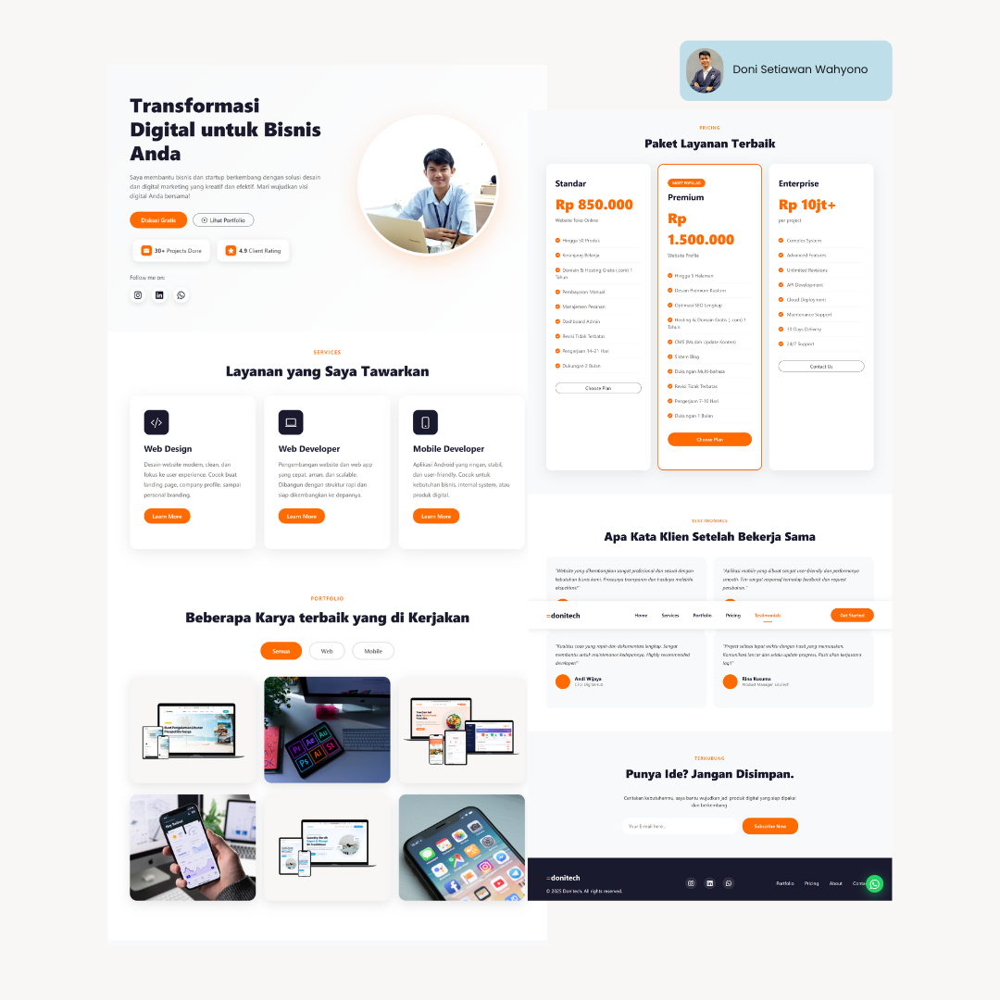
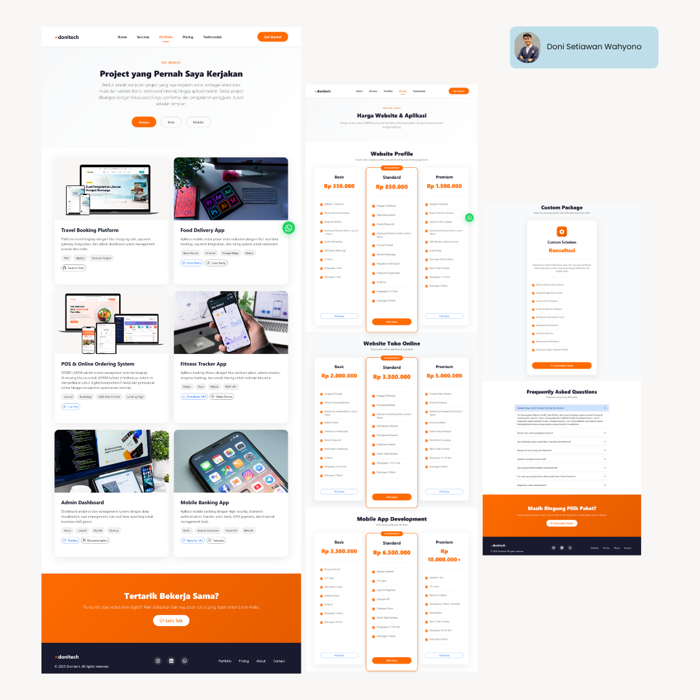

# 🚀 Modern Portfolio Website Template

> A modern, responsive, and customizable portfolio website template perfect for developers, designers, freelancers, and creative professionals. Built with Bootstrap 5 and vanilla JavaScript - no complex frameworks needed!

  
  

## Features

### **Modern & Clean Design**

- Minimalist and professional interface
- Smooth animations and transitions
- Eye-catching hero section with statistics
- Beautiful gradient overlays

### **Fully Responsive**

- Mobile-first approach
- Works perfectly on all devices (mobile, tablet, desktop)
- Optimized for different screen sizes
- Touch-friendly navigation

### **Easy to Customize**

- Well-organized code structure
- Clear comments and documentation
- Simple color scheme customization
- Easy content modification

### **Performance Optimized**

- Fast loading speed
- Lightweight codebase
- Optimized images
- Clean and efficient CSS/JS

### **Key Sections**

- **Hero Section** - Eye-catching introduction with CTA buttons
- **Services** - Showcase your skills and services
- **Portfolio** - Filterable project gallery
- **Pricing** - Display your pricing packages
- **Testimonials** - Build trust with client reviews
- **Contact/Newsletter** - Easy way for clients to reach you
- **Floating WhatsApp Button** - Direct communication

## Live Demo

[**View Live Demo →**](https://donisw.dev/)

## Technologies Used

- **HTML5** - Semantic markup
- **CSS3** - Modern styling with animations
- **JavaScript (ES6+)** - Interactive features
- **Bootstrap 5.3.0** - Responsive framework
- **Bootstrap Icons** - Beautiful icon library

## What's Included

✅ Fully responsive layout  
✅ Cross-browser compatible  
✅ SEO-friendly structure  
✅ Portfolio filter functionality  
✅ Smooth scroll navigation  
✅ WhatsApp integration  
✅ Newsletter subscription form  
✅ Social media integration  
✅ Modern UI/UX design  
✅ Clean and documented code

### Responsive Navigation

Mobile-friendly navbar with hamburger menu that collapses on small screens.

## Responsive Breakpoints

- **Mobile**: < 768px
- **Tablet**: 768px - 991px
- **Desktop**: ≥ 992px

## Use Cases

Perfect for:

- 💼 **Freelancers** - Showcase your services and attract clients
- 👨‍💻 **Developers** - Display your coding projects and skills
- 🎨 **Designers** - Present your creative portfolio
- 📸 **Photographers** - Gallery for your best work
- ✍️ **Writers** - Showcase your articles and content
- 🚀 **Startups** - Professional landing page
- 🎓 **Students** - Academic portfolio and projects

## Contributing

Contributions are welcome! Here's how you can help:

1. Fork the repository
2. Create a new branch (`git checkout -b feature/improvement`)
3. Make your changes
4. Commit your changes (`git commit -am 'Add new feature'`)
5. Push to the branch (`git push origin feature/improvement`)
6. Create a Pull Request

## License

This project is licensed under the MIT License - see the [LICENSE](LICENSE) file for details.

## Support

If you have any questions or need help customizing the template:

- Email: donisetiawanwahyono@gmail.com
- Issues: [GitHub Issues](https://github.com/donisettt/portfolio-responsive/issues)

## 🌟 Star This Repository

If you find this template useful, please give it a ⭐️! It helps others discover it.

## 📚 Related Projects

- [Awesome Portfolio Templates](https://github.com/topics/portfolio-template)
- [Bootstrap Templates](https://github.com/topics/bootstrap-template)
- [Responsive Landing Pages](https://github.com/topics/landing-page)

## Keywords

`portfolio template`, `responsive portfolio`, `bootstrap portfolio`, `developer portfolio`, `designer portfolio`, `freelancer portfolio`, `landing page`, `responsive website`, `html css portfolio`, `modern portfolio`, `portfolio website template`, `free portfolio template`, `bootstrap 5 portfolio`, `mobile responsive`, `portfolio design`

---

**[⬆ Back to Top](#-modern-portfolio-website-template)**

Made with ❤️ by [Doni Sw](https://github.com/donisettt)

⭐️ Star this repo if you found it helpful!

[Report Bug](https://github.com/donisettt/portfolio-responsive/issues) · [Request Feature](https://github.com/donisettt/portfolio-responsive/issues)

